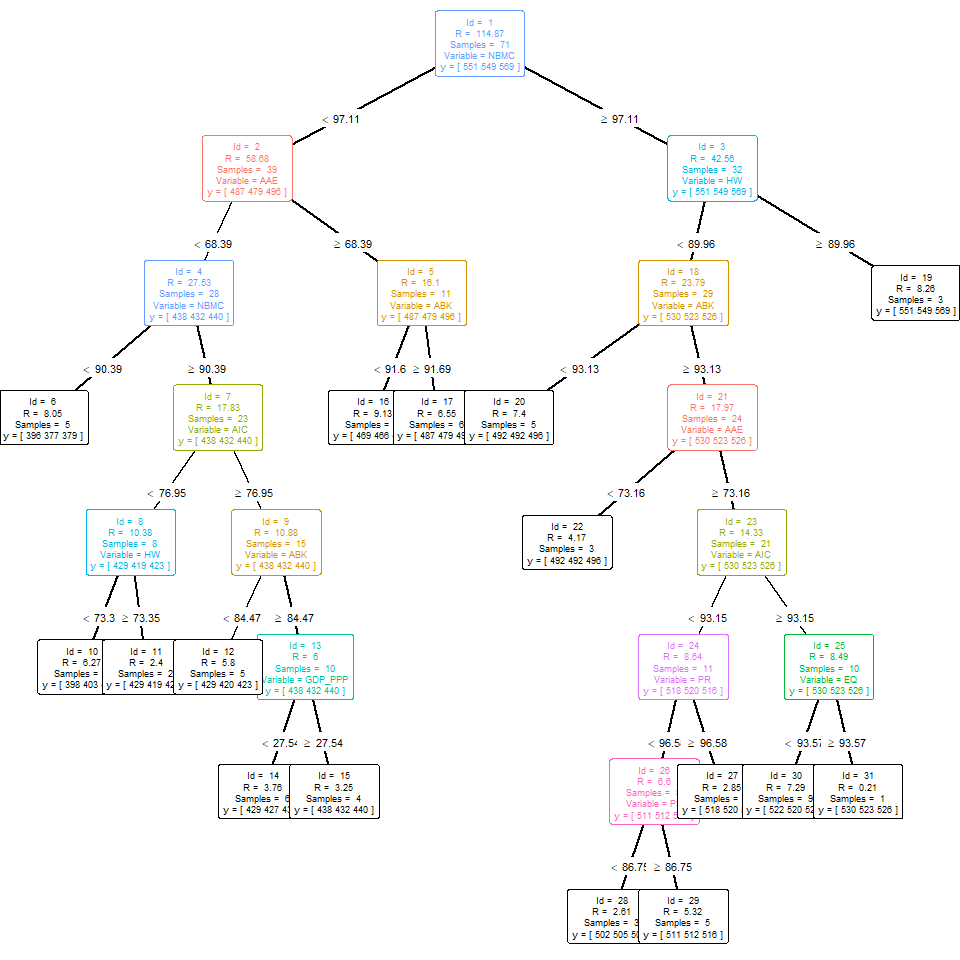
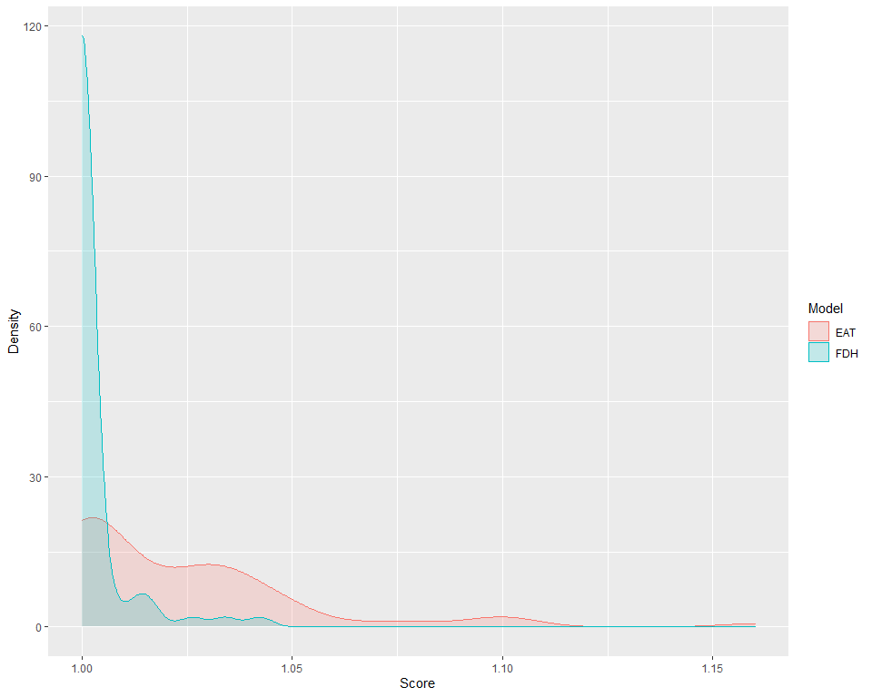

# EAT: Efficiency Analysis Trees

[Efficiency Analysis Trees](https://www.sciencedirect.com/science/article/pii/S0957417420306072) is an alghoritm by which a production frontier is obtained through and adaptation of regression trees based on CART. The generation of production frontiers falls within the field of efficiency analysis, of which some concepts must be known:

* A **production frontier** is a boundary defined for those feasible combinations of input and output that are efficient.
* A **DMU** (**D**ecision **M**aking **U**nits) is an observation of the dataset whose efficiency is to be assessed.
* A specific DMU is **efficient** when is located at the production frontier and it has room for improvement regarding its inputs or outputs when it is in the area below the frontier.

The `EAT` algorithm must be conceived as a modeling of the response variable (output) in order to know its most efficient levels for each of the different regions of the input space that are generated. Thus, subspaces with homogeneous DMUs (since they must share the characteristics of said subspace) are delimited and the maximun expected output for that subspace is provided. In this way, the `EAT` predictor results in a monotonic increasing frontier with a stepped form where each of these steps corresponds to a node of the tree which contains observations with efficient  and non-efficient output levels.


```r
library(eat)
data("PISAindex")
```

* EAT model with 1 input (`NBMC`) and 1 output (`S_PISA`).


```r
single_model <- EAT(data = PISAindex, 
                    x = 6,
                    y = 4,
                    numStop = 1,
                    fold = 5,
                    na.rm = TRUE)


|id |  N| Prop| R_PISA|   MSE|
|:--|--:|----:|------:|-----:|
|3  | 32|   45|    549| 38.68|
|4  | 15|   21|    420| 18.56|
|5  | 24|   34|    479| 33.86|
```

* Plot the frontier


```r
frontier(single_model,
         train.data = TRUE,
         train.color = "black",
         pch = 19,
         size = 1,
         rwn = TRUE)
```

<!-- -->

* EAT model with 18 inputs and 3 outputs


```r
multioutput <- EAT(data = PISAindex, 
                   x = 6:18,
                   y = 3:5,
                   numStop = 6,
                   fold = 5,
                   na.rm = TRUE)


|id |  N| Prop| S_PISA| R_PISA| M_PISA|   MSE|
|:--|--:|----:|------:|------:|------:|-----:|
|3  | 32|   45|    569|    432|    438| 42.56|
|6  |  5|    7|    496|    419|    429|  8.05|
|10 |  6|    8|    438|    440|    432|  6.27|
|11 |  2|    3|    432|    398|    440|  2.40|
|12 |  5|    7|    440|    403|    469|  5.80|
|14 |  6|    8|    479|    429|    454|  3.76|
|15 |  4|    6|    496|    419|    487|  3.25|
|16 |  5|    7|    396|    423|    479|  9.13|
|17 |  6|    8|    377|    429|    496|  6.55|
```

* Ranking of importance of variables for EAT


```r
ranking_EAT(object = multioutput,
            r = 2,
            threshold = 75,
            barplot = TRUE)
[[1]]
        Importance
AAE         100.00
WS           98.45
S            84.52
NBMC         83.34
HW           83.27
ABK          66.86
GDP_PPP      65.31
AIC          63.80
EQ           56.14
PR           56.14
I            56.14
PS           44.39
PFC          31.55

[[2]]
```

<!-- -->

* Plot an EAT model


```r
EAT_plot(object = multioutput)
```

<!-- -->

* Efficiency scores EAT


```r
scores_EAT <- efficiency_EAT(data = PISAindex,
                             x = 6:18,
                             y = 3:5,
                             object = multioutput,
                             scores_model = "EAT_BCC_out",
                             r = 2,
                             na.rm = TRUE)
    EAT_BCC_out
SGP        1.00
JPN        1.04
KOR        1.06
EST        1.04
NLD        1.10
POL        1.07
CHE        1.10
CAN        1.06
DNK        1.10
SVN        1.09
BEL        1.10
FIN        1.06
SWE        1.08
GBR        1.09
NOR        1.10
DEU        1.10
IRL        1.06
AUT        1.12
CZE        1.11
LVA        1.00
FRA        1.11
ISL        1.15
NZL        1.08
PRT        1.12
AUS        1.09
RUS        1.01
ITA        1.15
SVK        1.02
LUX        1.16
HUN        1.01
LTU        1.01
USA        1.09
BLR        1.16
MLT        1.19
HRV        1.15
ISR        1.17
TUR        1.00
UKR        1.00
CYP        1.10
GRC        1.20
SRB        1.01
MYS        1.00
ALB        1.00
BGR        1.00
ARE        1.00
MNE        1.01
ROU        1.01
KAZ        1.00
MDA        1.00
AZE        1.00
THA        1.01
URY        1.00
CHL        1.03
QAT        1.05
MEX        1.00
BIH        1.00
CRI        1.00
JOR        1.00
PER        1.05
GEO        1.04
MKD        1.04
LBN        1.04
COL        1.02
BRA        1.02
ARG        1.16
IDN        1.00
SAU        1.01
MAR        1.03
PAN        1.00
PHL        1.07
DOM        1.10


| Mean| Std. Dev.| Min| Q1| Median|   Q3| Max|
|----:|---------:|---:|--:|------:|----:|---:|
| 1.06|      0.06|   1|  1|   1.04| 1.04| 1.2|
```

* Efficiency scores FDH


```r
scores_FDH <- efficiency_FDH(data = PISAindex,
                             x = 6:18,
                             y = 3:5,
                             scores_model = "FDH_BCC_out",
                             r = 4,
                             na.rm = TRUE)
    FDH_BCC_out
SGP      1.0000
JPN      1.0000
KOR      1.0000
EST      1.0000
NLD      1.0000
POL      1.0000
CHE      1.0019
CAN      1.0000
DNK      1.0138
SVN      1.0000
BEL      1.0000
FIN      1.0000
SWE      1.0119
GBR      1.0000
NOR      1.0261
DEU      1.0159
IRL      1.0000
AUT      1.0341
CZE      1.0000
LVA      1.0000
FRA      1.0000
ISL      1.0424
NZL      1.0059
PRT      1.0000
AUS      1.0159
RUS      1.0000
ITA      1.0000
SVK      1.0000
LUX      1.0000
HUN      1.0000
LTU      1.0000
USA      1.0000
BLR      1.0000
MLT      1.0000
HRV      1.0000
ISR      1.0000
TUR      1.0000
UKR      1.0000
CYP      1.0000
GRC      1.0067
SRB      1.0000
MYS      1.0000
ALB      1.0000
BGR      1.0000
ARE      1.0000
MNE      1.0000
ROU      1.0000
KAZ      1.0000
MDA      1.0000
AZE      1.0000
THA      1.0000
URY      1.0000
CHL      1.0000
QAT      1.0000
MEX      1.0000
BIH      1.0000
CRI      1.0000
JOR      1.0000
PER      1.0000
GEO      1.0000
MKD      1.0000
LBN      1.0000
COL      1.0000
BRA      1.0000
ARG      1.0000
IDN      1.0000
SAU      1.0000
MAR      1.0000
PAN      1.0000
PHL      1.0000
DOM      1.0000


| Mean| Std. Dev.| Min| Q1| Median| Q3|  Max|
|----:|---------:|---:|--:|------:|--:|----:|
|    1|      0.01|   1|  1|      1|  1| 1.04|
```

* Efficiency jitter plot


```r
efficiency_jitter(object = multioutput,
                  scores_EAT = scores_EAT$EAT_BCC_out,
                  )
```

<!-- -->

* Efficiency density plot


```r
efficiency_density(scores_EAT = scores_EAT$EAT_BCC_out,
                   scores_FDH = scores_FDH$FDH_BCC_out)
```

<!-- -->

* EAT predict 


```r
predict_EAT(object = multioutput,
            newdata = PISAindex[, 6:18])
   S_PISA_pred R_PISA_pred M_PISA_pred
1          551         549         569
2          551         549         569
3          551         549         569
4          551         549         569
5          551         549         569
6          551         549         569
7          551         549         569
8          551         549         569
9          551         549         569
10         551         549         569
11         551         549         569
12         551         549         569
13         551         549         569
14         551         549         569
15         551         549         569
16         551         549         569
17         551         549         569
18         551         549         569
19         551         549         569
20         487         479         496
21         551         549         569
22         551         549         569
23         551         549         569
24         551         549         569
25         551         549         569
26         487         479         496
27         551         549         569
28         487         479         496
29         551         549         569
30         487         479         496
31         487         479         496
32         551         549         569
33         551         549         569
34         551         549         569
35         551         549         569
36         551         549         569
37         551         549         569
38         469         466         454
39         469         466         454
40         487         479         496
41         551         549         569
42         469         466         454
43         438         432         440
44         429         427         437
45         429         427         437
46         438         432         440
47         429         427         437
48         438         432         440
49         398         403         423
50         429         427         437
51         398         403         423
52         429         419         423
53         429         427         437
54         469         466         454
55         438         432         440
56         429         420         423
57         398         403         423
58         429         427         437
59         429         419         423
60         429         420         423
61         398         403         423
62         429         420         423
63         398         403         423
64         429         420         423
65         429         420         423
66         469         466         454
67         396         377         379
68         398         403         423
69         396         377         379
70         396         377         379
71         396         377         379
72         396         377         379
```

* RFEAT model


```r
RFEAT_model <- RFEAT(data = PISAindex,
                     x = 6:18,
                     y = 3:5,
                     numStop = 5,
                     m = 5,
                     s_mtry = "Breiman",
                     na.rm = TRUE)
```

* RFEAT ranking


```r
ranking_RFEAT(object = RFEAT_model,
              r = 4,
              barplot = TRUE)
[[1]]
        Importance
NBMC     17.159725
PFC      17.056316
EQ       17.053555
ABK      11.698154
PS       10.397773
I         8.598747
HW        8.287525
PR        7.083059
AAE       1.209509
S        -1.122122
AIC      -2.610971
WS       -4.497835
GDP_PPP -14.134457

[[2]]
```

<!-- -->

* RFEAT scores


```r
efficiency_RFEAT(data = PISAindex,
                 x = 6:18,
                 y = 3:5,
                 object = RFEAT_model)
     scoreRF
SGP 0.902988
JPN 1.016635
KOR 1.003083
EST 0.969434
NLD 0.996532
POL 0.979457
CHE 1.023689
CAN 0.990769
DNK 1.011002
SVN 1.003550
BEL 0.998031
FIN 0.994615
SWE 1.015020
GBR 1.002772
NOR 1.032465
DEU 1.016302
IRL 0.991506
AUT 1.027255
CZE 1.009256
LVA 0.996774
FRA 1.017039
ISL 1.069495
NZL 1.007480
PRT 0.988618
AUS 1.016302
RUS 0.981557
ITA 1.008624
SVK 0.960082
LUX 0.975745
HUN 0.973109
LTU 1.017427
USA 0.989703
BLR 1.006751
MLT 0.984322
HRV 0.970772
ISR 1.020426
TUR 0.950215
UKR 0.998294
CYP 1.058093
GRC 1.049891
SRB 1.014732
MYS 0.996364
ALB 0.988101
BGR 1.007798
ARE 1.008295
MNE 1.015202
ROU 0.990187
KAZ 1.033097
MDA 1.006542
AZE 0.940000
THA 0.919809
URY 1.015457
CHL 1.019912
QAT 1.036754
MEX 0.980476
BIH 1.011414
CRI 1.017840
JOR 1.004196
PER 0.944638
GEO 1.057286
MKD 1.000484
LBN 1.019847
COL 1.005825
BRA 0.993220
ARG 1.173632
IDN 1.000000
SAU 1.036090
MAR 1.011957
PAN 0.968700
PHL 1.031728
DOM 1.037427
```

* RFEAT predict


```r
predict_RFEAT(object = RFEAT_model,
              newdata = PISAindex[, 6:18])
   S_PISA_pred R_PISA_pred M_PISA_pred
1        505.4       506.8       513.8
2        537.8       531.6       543.8
3        520.6       521.0       528.6
4        513.8       508.0       514.4
5        511.8       512.4       517.2
6        502.6       503.6       505.4
7        518.4       519.4       527.2
8        514.0       515.2       514.6
9        511.2       512.4       514.6
10       508.8       508.0       511.8
11       503.2       505.2       507.0
12       521.4       517.2       519.0
13       511.2       513.6       513.2
14       506.4       508.2       507.2
15       517.6       515.2       521.0
16       511.2       512.4       514.6
17       511.8       513.6       516.6
18       506.8       506.4       512.6
19       501.6       499.6       505.2
20       486.2       481.6       494.4
21       501.4       502.4       506.0
22       524.8       522.6       529.4
23       511.8       513.6       514.6
24       486.4       487.6       493.8
25       511.2       513.6       513.2
26       473.8       473.0       479.0
27       487.2       489.6       491.2
28       460.8       458.8       466.6
29       466.4       458.6       471.4
30       468.2       463.2       473.8
31       490.4       486.2       493.4
32       498.0       497.6       495.2
33       499.6       499.8       502.0
34       480.6       477.2       483.4
35       457.6       453.2       464.6
36       464.4       465.0       468.0
37       477.2       479.6       477.2
38       448.6       442.8       447.4
39       468.2       465.6       469.0
40       476.2       477.0       477.2
41       479.2       479.8       478.2
42       452.6       449.8       454.6
43       437.8       435.8       438.4
44       425.6       421.2       431.8
45       433.0       429.6       439.4
46       437.6       437.0       439.0
47       430.6       427.4       437.8
48       424.6       423.8       429.8
49       436.2       434.0       437.0
50       430.8       427.0       429.8
51       395.2       384.4       394.8
52       393.2       378.0       385.4
53       434.0       433.6       427.6
54       464.0       461.0       468.8
55       434.4       433.4       433.4
56       415.4       411.8       407.2
57       413.2       407.6       414.6
58       431.4       433.6       427.0
59       430.8       424.8       415.8
60       388.2       378.8       381.8
61       418.0       409.4       420.8
62       413.2       407.6       414.6
63       403.6       393.6       400.8
64       424.6       414.4       410.8
65       413.0       410.2       411.2
66       475.0       471.8       475.0
67       396.0       373.4       381.8
68       413.4       413.4       413.8
69       384.6       368.6       372.4
70       380.6       365.2       369.4
71       372.8       359.0       364.2
72       364.2       354.8       352.2
```
