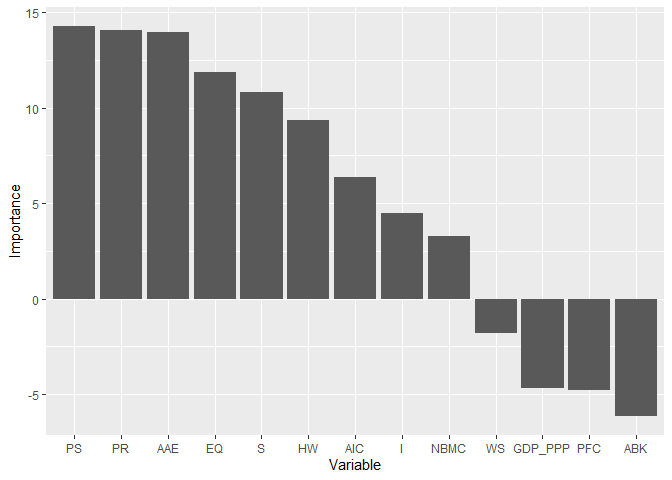

<!-- README.md is generated from README.Rmd. Please edit that file -->

# eat

The `EAT` algorithm performs a regression tree based on CART methodology
under a new approach that guarantees obtaining a frontier as estimator
that fulfills the property of free disposability. This new technique has
been baptized as Efficiency Analysis Trees. Some of its main functions
are:

  - To create homogeneous groups of DMUs in terms of their inputs and to
    know for each of these groups, what is the maximum output expected.

  - To know which DMUs exercise best practices and which of them do not
    obtain a performance according to their resources level.

  - To know what variables are more relevant in obtaining efficient
    levels of output.

## Installation

You can install the released version of eat from
[CRAN](https://CRAN.R-project.org) with:

``` r
install.packages("eat")
```

And the development version from
[GitHub](https://github.com/MiriamEsteve/EAT) with:

``` r
# install.packages("devtools")
devtools::install_github("MiriamEsteve/EAT")
```

## Example

``` r
library(eat)
data("PISAindex")
```

  - EAT model with 1 input (`NBMC`) and 1 output (`S_PISA`)

<!-- end list -->

``` r
single_model <- EAT(data = PISAindex, 
                    x = 15, # input 
                    y = 3) # output
#> [conflicted] Will prefer dplyr::filter over any other package
```

  - Print an EAT object

<!-- end list -->

``` r
print(single_model)
```

    #>  [1] y: [ 551 ] || R: 11507.5 n(t): 72 
    #>  
    #>  |  [2] PFC < 77.2 --> y: [ 478 ] || R: 2324.47 n(t): 34 
    #>  
    #>  |   |  [4] PFC < 65.45 --> y: [ 428 ] || R: 390.17 n(t): 16 
    #>  
    #>  |   |   |  [6] PFC < 61.31 --> y: [ 417 ] || R: 169.56 n(t): 7 
    #>  
    #>  |   |   |   |  [8] PFC < 59.4 --> y: [ 417 ] <*> || R: 112.19 n(t): 4 
    #>  
    #>  |   |   |   |  [9] PFC >= 59.4 --> y: [ 417 ] <*> || R: 57.36 n(t): 3 
    #>  
    #>  |   |   |  [7] PFC >= 61.31 --> y: [ 428 ] || R: 139.79 n(t): 9 
    #>  
    #>  |   |   |   |   |  [10] PFC < 61.35 --> y: [ 428 ] <*> || R: 0 n(t): 1 
    #>  
    #>  |   |   |   |   |  [11] PFC >= 61.35 --> y: [ 428 ] <*> || R: 139.79 n(t): 8 
    #>  
    #>  |   |  [5] PFC >= 65.45 --> y: [ 478 ] <*> || R: 637.08 n(t): 18 
    #>  
    #>  |  [3] PFC >= 77.2 --> y: [ 551 ] <*> || R: 2452.83 n(t): 38 
    #> 

  - Summary of an EAT object

<!-- end list -->

``` r
summary(single_model)
```

    #> 
    #>   Formula:  S_PISA ~ PFC 
    #> 
    #>  # ========================== # 
    #>  #   Summary for leaf nodes   # 
    #>  # ========================== # 
    #>  
    #>  id n(t)  % S_PISA    R(t)
    #>   3   38 53    551 2452.83
    #>   5   18 25    478  637.08
    #>   8    4  6    417  112.19
    #>   9    3  4    417   57.36
    #>  10    1  1    428    0.00
    #>  11    8 11    428  139.79
    #> 
    #>  # ========================== # 
    #>  #            Tree            # 
    #>  # ========================== # 
    #>  
    #>  Inner nodes: 5 
    #>   Leaf nodes: 6 
    #>  Total nodes: 11 
    #>  
    #>        R(T): 3399.25 
    #>      numStop: 5 
    #>         fold: 5 
    #>    max.depth:
    #>  
    #>  # ========================== # 
    #>  # Primary & surrogate splits # 
    #>  # ========================== # 
    #>  
    #>  Node 1 --> {2,3} || PFC --> {R: 4777.31, s: 77.2}
    #> 
    #>  Node 2 --> {4,5} || PFC --> {R: 1027.25, s: 65.45}
    #> 
    #>  Node 4 --> {6,7} || PFC --> {R: 309.35, s: 61.31}
    #> 
    #>  Node 6 --> {8,9} || PFC --> {R: 169.56, s: 59.4}
    #> 
    #>  Node 7 --> {10,11} || PFC --> {R: 139.79, s: 61.35}

  - Number of leaf nodes of an EAT object

<!-- end list -->

``` r
size(single_model)
```

    #> [1] 6

  - Frontier levels of output for an EAT object

<!-- end list -->

``` r
frontier.levels(single_model)
```

    #>   S_PISA
    #> 1    551
    #> 2    478
    #> 3    417
    #> 4    428

  - Descriptive analysis for an EAT object

<!-- end list -->

``` r
descriptiveEAT <- descrEAT(single_model)

# Descriptive for the nodes 1-3
descriptiveEAT[1:3]
```

    #> [[1]]
    #>        Node n(t)   %   mean     var    sd min     Q1 median     Q3 max   RMSE
    #> S_PISA    1   72 100 455.06 2334.59 48.32 336 416.75    466 495.25 551 107.27
    #> 
    #> [[2]]
    #>        Node n(t)  %   mean     var    sd min     Q1 median     Q3 max  RMSE
    #> S_PISA    2   34 47 416.88 1223.02 34.97 336 397.25  415.5 435.75 478 70.16
    #> 
    #> [[3]]
    #>        Node n(t)  %   mean    var    sd min  Q1 median    Q3 max  RMSE
    #> S_PISA    3   38 53 489.21 851.95 29.19 419 478    494 504.5 551 68.17

  - Plot the frontier

<!-- end list -->

``` r
frontier(object = single_model,
         FDH = TRUE, 
         train.data = TRUE,
         rwn = TRUE)
```


  - EAT model with 18 inputs and 3 outputs

<!-- end list -->

``` r
multioutput <- EAT(data = PISAindex, 
                   x = 6:18,
                   y = 3:5)
```

    #> [conflicted] Removing existing preference

    #> [conflicted] Will prefer dplyr::filter over any other package

    #> Warning in preProcess(data, x, y, na.rm = na.rm): Rows with NA values have been omitted

  - Ranking of importance of variables for EAT

<!-- end list -->

``` r
rankingEAT(object = multioutput,
           r = 2,
           barplot = TRUE,
           threshold = 70)
```

    #> $scores
    #>         Importance
    #> AAE         100.00
    #> WS           98.45
    #> S            84.51
    #> NBMC         83.37
    #> HW           83.31
    #> ABK          67.97
    #> GDP_PPP      65.37
    #> AIC          64.89
    #> EQ           57.11
    #> PR           57.05
    #> I            57.05
    #> PS           45.41
    #> PFC          31.67
    #> 
    #> $barplot


  - Plot an EAT model

<!-- end list -->

``` r
plotEAT(object = multioutput)
```


  - Tuning an EAT model

<!-- end list -->

``` r
n <- nrow(PISAindex) # Observations in the dataset
t_index <- sample(1:n, n * 0.7) # Training indexes
training <- PISAindex[t_index, ] # Training set
test <- PISAindex[-t_index, ] # Test set

bestEAT(training = training, 
        test = test,
        x = 6:18,
        y = 3:5,
        numStop = c(5, 7, 10),
        fold = c(5, 7))
```

    #> [conflicted] Removing existing preference

    #> [conflicted] Will prefer dplyr::filter over any other package

    #> Warning in preProcess(data, x, y, na.rm = na.rm): Rows with NA values have been omitted

    #> [conflicted] Removing existing preference
    #> [conflicted] Will prefer dplyr::filter over any other package

    #> Warning in preProcess(data, x, y, na.rm = na.rm): Rows with NA values have been omitted

    #> [conflicted] Removing existing preference
    #> [conflicted] Will prefer dplyr::filter over any other package

    #> Warning in preProcess(data, x, y, na.rm = na.rm): Rows with NA values have been omitted

    #> [conflicted] Removing existing preference
    #> [conflicted] Will prefer dplyr::filter over any other package

    #> Warning in preProcess(data, x, y, na.rm = na.rm): Rows with NA values have been omitted

    #> [conflicted] Removing existing preference
    #> [conflicted] Will prefer dplyr::filter over any other package

    #> Warning in preProcess(data, x, y, na.rm = na.rm): Rows with NA values have been omitted

    #> [conflicted] Removing existing preference
    #> [conflicted] Will prefer dplyr::filter over any other package

    #> Warning in preProcess(data, x, y, na.rm = na.rm): Rows with NA values have been omitted

    #>   numStop fold  RMSE leaves
    #> 1       7    7 56.15     10
    #> 2       5    5 56.28     12
    #> 3       5    7 59.82     11
    #> 4       7    5 84.34      6
    #> 5      10    5 84.91      5
    #> 6      10    7 84.91      5

  - Efficiency scores EAT

<!-- end list -->

``` r
scores_EAT <-  efficiencyEAT(data = PISAindex,
                            x = 15, 
                            y = 3,
                            object = single_model, 
                            scores_model = "BCC_out",
                            r = 3,
                            FDH = TRUE)
```

    #>     EAT_BCC_out FDH_BCC_out
    #> SGP       1.000       1.000
    #> JPN       1.042       1.000
    #> KOR       1.062       1.000
    #> EST       1.040       1.000
    #> NLD       1.095       1.095
    #> POL       1.078       1.000
    #> CHE       1.113       1.113
    #> CAN       1.064       1.064
    #> DNK       1.118       1.118
    #> SVN       1.087       1.024
    #> BEL       1.104       1.062
    #> FIN       1.056       1.056
    #> SWE       1.104       1.104
    #> GBR       1.091       1.091
    #> NOR       1.124       1.124
    #> DEU       1.095       1.095
    #> IRL       1.111       1.069
    #> AUT       1.124       1.082
    #> CZE       1.109       1.044
    #> LVA       1.131       1.066
    #> FRA       1.118       1.075
    #> ISL       1.160       1.116
    #> NZL       1.085       1.043
    #> PRT       1.120       1.055
    #> AUS       1.095       1.054
    #> RUS       1.000       1.000
    #> ITA       1.021       1.021
    #> SVK       1.188       1.037
    #> LUX       1.155       1.155
    #> HUN       1.146       1.000
    #> LTU       1.143       1.060
    #> ESP       1.141       1.075
    #> USA       1.098       1.056
    #> BLR       1.015       1.015
    #> MLT       1.193       1.106
    #> HRV       1.006       1.006
    #> ISR       1.193       1.106
    #> TUR       1.021       1.000
    #> UKR       1.019       1.000
    #> CYP       1.255       1.182
    #> GRC       1.058       1.058
    #> SRB       1.086       1.000
    #> MYS       1.091       1.068
    #> ALB       1.000       1.000
    #> BGR       1.127       1.127
    #> ARE       1.270       1.177
    #> MNE       1.152       1.128
    #> ROU       1.122       1.122
    #> KAZ       1.204       1.179
    #> MDA       1.000       1.000
    #> AZE       1.048       1.048
    #> THA       1.005       1.005
    #> URY       1.293       1.200
    #> CHL       1.241       1.169
    #> QAT       1.315       1.239
    #> MEX       1.021       1.021
    #> BIH       1.048       1.048
    #> CRI       1.149       1.149
    #> JOR       1.114       1.093
    #> PER       1.032       1.032
    #> GEO       1.089       1.089
    #> MKD       1.036       1.036
    #> LBN       1.115       1.115
    #> COL       1.036       1.036
    #> BRA       1.183       1.158
    #> ARG       1.183       1.158
    #> IDN       1.081       1.081
    #> SAU       1.238       1.215
    #> MAR       1.135       1.135
    #> PAN       1.173       1.173
    #> PHL       1.168       1.168
    #> DOM       1.241       1.241
    #> 
    #>  Model Mean Std. Dev. Min   Q1 Median   Q3  Max
    #>    EAT 1.11      0.07   1 1.05   1.11 1.11 1.32
    #> 
    #>  Model Mean Std. Dev. Min   Q1 Median   Q3  Max
    #>    FDH 1.08      0.06   1 1.03   1.07 1.07 1.24

  - Efficiency scores convex EAT

<!-- end list -->

``` r
scores_CEAT <- efficiencyCEAT(data = PISAindex,
                              x = 15, 
                              y = 3,
                              object = single_model, 
                              scores_model = "BCC_in",
                              r = 3,
                              DEA = TRUE)
```

    #>     CEAT_BCC_in DEA_BCC_in
    #> SGP       0.878      1.000
    #> JPN       0.877      0.986
    #> KOR       0.886      0.989
    #> EST       0.862      0.969
    #> NLD       0.747      0.824
    #> POL       0.872      0.968
    #> CHE       0.709      0.777
    #> CAN       0.775      0.865
    #> DNK       0.705      0.772
    #> SVN       0.832      0.920
    #> BEL       0.747      0.821
    #> FIN       0.794      0.888
    #> SWE       0.735      0.809
    #> GBR       0.760      0.840
    #> NOR       0.694      0.757
    #> DEU       0.734      0.809
    #> IRL       0.743      0.816
    #> AUT       0.725      0.792
    #> CZE       0.801      0.880
    #> LVA       0.774      0.843
    #> FRA       0.738      0.808
    #> ISL       0.687      0.739
    #> NZL       0.779      0.862
    #> PRT       0.791      0.865
    #> AUS       0.766      0.845
    #> RUS       0.866      0.936
    #> ITA       0.778      0.832
    #> SVK       0.739      0.787
    #> LUX       0.676      0.729
    #> HUN       0.797      0.864
    #> LTU       0.785      0.851
    #> ESP       0.772      0.838
    #> USA       0.767      0.846
    #> BLR       0.770      0.826
    #> MLT       0.726      0.771
    #> HRV       0.813      0.875
    #> ISR       0.726      0.771
    #> TUR       0.891      0.953
    #> UKR       0.855      0.916
    #> CYP       0.656      0.678
    #> GRC       0.782      0.822
    #> SRB       0.800      0.829
    #> MYS       0.767      0.792
    #> ALB       1.000      1.000
    #> BGR       0.683      0.691
    #> ARE       0.646      0.663
    #> MNE       0.698      0.698
    #> ROU       0.691      0.701
    #> KAZ       0.696      0.696
    #> MDA       0.811      0.825
    #> AZE       0.967      0.967
    #> THA       0.776      0.787
    #> URY       0.627      0.637
    #> CHL       0.665      0.692
    #> QAT       0.597      0.599
    #> MEX       0.753      0.755
    #> BIH       0.782      0.782
    #> CRI       0.615      0.615
    #> JOR       0.717      0.731
    #> PER       0.795      0.795
    #> GEO       0.798      0.798
    #> MKD       0.768      0.768
    #> LBN       0.735      0.735
    #> COL       0.739      0.739
    #> BRA       0.697      0.697
    #> ARG       0.693      0.693
    #> IDN       0.735      0.735
    #> SAU       0.674      0.674
    #> MAR       0.748      0.748
    #> PAN       0.770      0.770
    #> PHL       0.780      0.780
    #> DOM       0.804      0.804
    #> 
    #>  Model Mean Std. Dev. Min   Q1 Median   Q3 Max
    #>   CEAT 0.76      0.07 0.6 0.72   0.77 0.77   1
    #> 
    #>  Model Mean Std. Dev. Min   Q1 Median  Q3 Max
    #>    DEA  0.8      0.09 0.6 0.74    0.8 0.8   1

  - Efficiency jitter plot

<!-- end list -->

``` r
efficiencyJitter(object = single_model,
                 scores_EAT = scores_EAT$EAT_BCC_out,
                 scores_model = "BCC_out",
                 lwb = 1.2)
```

    #> Warning: Removed 1 rows containing missing values (geom_segment).


  - Efficiency density plot

<!-- end list -->

``` r
efficiencyDensity(scores = scores_EAT[, 3:4],
                  model = c("EAT", "FDH"))
```


  - RFEAT model

<!-- end list -->

``` r
forest <- RFEAT(data = PISAindex, 
                x = 6:18, # input 
                y = 5, # output
                numStop = 5, 
                m = 30,
                s_mtry = "Breiman",
                na.rm = TRUE)
```

    #> [conflicted] Removing existing preference

    #> [conflicted] Will prefer dplyr::filter over any other package

  - Print a RFEAT object

<!-- end list -->

``` r
print(forest)
```

    #> 
    #>   Formula:  M_PISA ~ NBMC + WS + S + PS + ABK + AIC + HW + EQ + PR + PFC + I + AAE + GDP_PPP 
    #> 
    #>  # ========================== # 
    #>  #           Forest           # 
    #>  # ========================== # 
    #>  
    #>  Error: 697.51
    #>  numStop: 5
    #>  No. of trees (m): 30
    #>  No. of inputs tried (s_mtry): Breiman

  - Plot the Out-of-Bag error for a forest of k trees

<!-- end list -->

``` r
plotRFEAT(forest)
```


  - RFEAT ranking

<!-- end list -->

``` r
rankingRFEAT(object = forest, r = 2,
             barplot = TRUE)
```

    #> [conflicted] Removing existing preference

    #> [conflicted] Will prefer dplyr::filter over any other package

    #> [conflicted] Removing existing preference

    #> [conflicted] Will prefer dplyr::filter over any other package

    #> [conflicted] Removing existing preference

    #> [conflicted] Will prefer dplyr::filter over any other package

    #> [conflicted] Removing existing preference

    #> [conflicted] Will prefer dplyr::filter over any other package

    #> [conflicted] Removing existing preference

    #> [conflicted] Will prefer dplyr::filter over any other package

    #> [conflicted] Removing existing preference

    #> [conflicted] Will prefer dplyr::filter over any other package

    #> [conflicted] Removing existing preference

    #> [conflicted] Will prefer dplyr::filter over any other package

    #> [conflicted] Removing existing preference

    #> [conflicted] Will prefer dplyr::filter over any other package

    #> [conflicted] Removing existing preference

    #> [conflicted] Will prefer dplyr::filter over any other package

    #> [conflicted] Removing existing preference

    #> [conflicted] Will prefer dplyr::filter over any other package

    #> [conflicted] Removing existing preference

    #> [conflicted] Will prefer dplyr::filter over any other package

    #> [conflicted] Removing existing preference

    #> [conflicted] Will prefer dplyr::filter over any other package

    #> [conflicted] Removing existing preference

    #> [conflicted] Will prefer dplyr::filter over any other package

    #> $scores
    #>         Importance
    #> PR       -23.06378
    #> EQ       -26.07013
    #> PFC      -30.10838
    #> NBMC     -32.96397
    #> WS       -45.09572
    #> I        -45.82810
    #> HW       -47.50257
    #> AAE      -52.64372
    #> ABK      -57.38680
    #> S        -60.83414
    #> AIC      -62.62760
    #> GDP_PPP  -64.81791
    #> PS       -67.72009
    #> 
    #> $barplot



  - Tuning a RFEAT model

<!-- end list -->

``` r
bestRFEAT(training = training, 
          test = test,
          x = 6:18,
          y = 3:5,
          numStop = c(5, 10),
          m = c(30, 35, 40),
          s_mtry = c("Breiman", "3"))
```

    #> [conflicted] Removing existing preference

    #> [conflicted] Will prefer dplyr::filter over any other package

    #> Warning in preProcess(data, x, y, na.rm = na.rm): Rows with NA values have been omitted

    #> [conflicted] Removing existing preference
    #> [conflicted] Will prefer dplyr::filter over any other package

    #> Warning in preProcess(data, x, y, na.rm = na.rm): Rows with NA values have been omitted

    #> [conflicted] Removing existing preference
    #> [conflicted] Will prefer dplyr::filter over any other package

    #> Warning in preProcess(data, x, y, na.rm = na.rm): Rows with NA values have been omitted

    #> [conflicted] Removing existing preference
    #> [conflicted] Will prefer dplyr::filter over any other package

    #> Warning in preProcess(data, x, y, na.rm = na.rm): Rows with NA values have been omitted

    #> [conflicted] Removing existing preference
    #> [conflicted] Will prefer dplyr::filter over any other package

    #> Warning in preProcess(data, x, y, na.rm = na.rm): Rows with NA values have been omitted

    #> [conflicted] Removing existing preference
    #> [conflicted] Will prefer dplyr::filter over any other package

    #> Warning in preProcess(data, x, y, na.rm = na.rm): Rows with NA values have been omitted

    #> [conflicted] Removing existing preference
    #> [conflicted] Will prefer dplyr::filter over any other package

    #> Warning in preProcess(data, x, y, na.rm = na.rm): Rows with NA values have been omitted

    #> [conflicted] Removing existing preference
    #> [conflicted] Will prefer dplyr::filter over any other package

    #> Warning in preProcess(data, x, y, na.rm = na.rm): Rows with NA values have been omitted

    #> [conflicted] Removing existing preference
    #> [conflicted] Will prefer dplyr::filter over any other package

    #> Warning in preProcess(data, x, y, na.rm = na.rm): Rows with NA values have been omitted

    #> [conflicted] Removing existing preference
    #> [conflicted] Will prefer dplyr::filter over any other package

    #> Warning in preProcess(data, x, y, na.rm = na.rm): Rows with NA values have been omitted

    #> [conflicted] Removing existing preference
    #> [conflicted] Will prefer dplyr::filter over any other package

    #> Warning in preProcess(data, x, y, na.rm = na.rm): Rows with NA values have been omitted

    #> [conflicted] Removing existing preference
    #> [conflicted] Will prefer dplyr::filter over any other package

    #> Warning in preProcess(data, x, y, na.rm = na.rm): Rows with NA values have been omitted

    #>    numStop  m  s_mtry  RMSE
    #> 1        5 35       3 43.49
    #> 2        5 40       3 43.56
    #> 3        5 35 Breiman 45.05
    #> 4        5 30       3 45.16
    #> 5        5 30 Breiman 45.17
    #> 6       10 35       3 47.02
    #> 7        5 40 Breiman 47.47
    #> 8       10 30 Breiman 47.58
    #> 9       10 30       3 49.55
    #> 10      10 35 Breiman 49.78
    #> 11      10 40       3 51.32
    #> 12      10 40 Breiman 51.74

  - RFEAT scores

<!-- end list -->

``` r
efficiencyRFEAT(data = PISAindex,
                x = 6:18, # input
                y = 5, # output
                object = forest,
                FDH = TRUE)
```

    #>     RFEAT_BCC_out FDH_BCC_out
    #> SGP          0.95        1.00
    #> JPN          1.04        1.00
    #> KOR          1.00        1.00
    #> EST          0.98        1.00
    #> NLD          1.00        1.00
    #> POL          0.97        1.00
    #> CHE          1.02        1.00
    #> CAN          1.01        1.01
    #> DNK          1.01        1.01
    #> SVN          1.00        1.00
    #> BEL          0.99        1.00
    #> FIN          1.02        1.02
    #> SWE          1.02        1.03
    #> GBR          1.01        1.00
    #> NOR          1.03        1.03
    #> DEU          1.02        1.03
    #> IRL          1.03        1.03
    #> AUT          1.02        1.03
    #> CZE          1.01        1.00
    #> LVA          0.99        1.00
    #> FRA          1.01        1.00
    #> ISL          1.08        1.04
    #> NZL          1.04        1.04
    #> PRT          0.98        1.00
    #> AUS          1.04        1.05
    #> RUS          0.98        1.00
    #> ITA          0.99        1.00
    #> SVK          0.98        1.00
    #> LUX          1.03        1.00
    #> HUN          1.00        1.00
    #> LTU          1.01        1.00
    #> ESP          1.01        1.00
    #> USA          1.03        1.00
    #> BLR          1.00        1.00
    #> MLT          1.01        1.00
    #> HRV          1.02        1.00
    #> ISR          1.02        1.00
    #> TUR          0.98        1.00
    #> UKR          0.98        1.00
    #> CYP          1.07        1.00
    #> GRC          1.03        1.01
    #> SRB          0.99        1.00
    #> MYS          1.00        1.00
    #> ALB          1.00        1.00
    #> BGR          1.01        1.00
    #> ARE          0.99        1.00
    #> MNE          1.02        1.00
    #> ROU          1.02        1.00
    #> KAZ          1.03        1.00
    #> MDA          1.01        1.00
    #> AZE          0.99        1.00
    #> THA          0.98        1.00
    #> URY          1.04        1.00
    #> CHL          1.09        1.00
    #> QAT          1.05        1.00
    #> MEX          1.00        1.00
    #> BIH          1.02        1.00
    #> CRI          1.06        1.00
    #> JOR          1.02        1.00
    #> PER          0.98        1.00
    #> GEO          1.08        1.00
    #> MKD          1.04        1.00
    #> LBN          1.02        1.00
    #> COL          1.03        1.00
    #> BRA          1.05        1.00
    #> ARG          1.15        1.00
    #> IDN          1.00        1.00
    #> SAU          1.09        1.00
    #> MAR          1.02        1.00
    #> PAN          1.07        1.00
    #> PHL          1.05        1.00
    #> DOM          1.11        1.00
    #> 
    #>  Model Mean Std. Dev.  Min Q1 Median   Q3  Max
    #>  RFEAT 1.02      0.03 0.95  1   1.02 1.02 1.15
    #> 
    #>  Model Mean Std. Dev. Min Q1 Median Q3  Max
    #>    FDH    1      0.01   1  1      1  1 1.05

  - EAT, RFEAT and FDH predictions

<!-- end list -->

``` r
input <- c(6, 7, 8, 12, 17)
output <- 3:5

which(is.na(PISAindex), arr.ind = TRUE)
```

    #>     row col
    #> ESP  32   4

``` r
# FDH does not accept NA rows, so we exclude ESP

EAT_model <- EAT(data = PISAindex[- 32, ],
                 x = input,
                 y = output)
```

    #> [conflicted] Removing existing preference

    #> [conflicted] Will prefer dplyr::filter over any other package

``` r
RFEAT_model <- RFEAT(data = PISAindex[- 32, ],
                     x = input,
                     y = output)
```

    #> [conflicted] Removing existing preference
    #> [conflicted] Will prefer dplyr::filter over any other package

``` r
# PREDICTIONS

predictions_EAT <- predictEAT(object = EAT_model,
                              newdata = PISAindex[- 32, input])
```

    #>    S_PISA_pred R_PISA_pred M_PISA_pred
    #> 1          551         549         569
    #> 2          551         549         569
    #> 3          519         514         526
    #> 4          530         523         526
    #> 5          511         512         519
    #> 6          511         512         516
    #> 7          551         549         569
    #> 8          530         523         526
    #> 9          511         512         516
    #> 10         511         512         516
    #> 11         511         512         516
    #> 12         530         523         526
    #> 13         530         523         526
    #> 14         511         512         519
    #> 15         530         523         526
    #> 16         511         512         516
    #> 17         530         523         526
    #> 18         511         512         516
    #> 19         511         512         516
    #> 20         487         479         496
    #> 21         530         523         526
    #> 22         530         523         526
    #> 23         530         523         526
    #> 24         492         492         496
    #> 25         530         523         526
    #> 26         487         479         496
    #> 27         511         512         516
    #> 28         481         476         486
    #> 29         492         492         496
    #> 30         481         476         486
    #> 31         487         479         496
    #> 32         511         512         516
    #> 33         492         492         496
    #> 34         492         492         496
    #> 35         492         492         496
    #> 36         492         492         496
    #> 37         469         466         454
    #> 38         469         466         454
    #> 39         481         476         486
    #> 40         511         512         516
    #> 41         469         466         454
    #> 42         438         432         440
    #> 43         426         405         437
    #> 44         438         432         440
    #> 45         438         432         440
    #> 46         415         421         430
    #> 47         438         432         440
    #> 48         426         405         437
    #> 49         428         424         437
    #> 50         404         401         420
    #> 51         426         405         437
    #> 52         429         427         437
    #> 53         487         479         496
    #> 54         429         427         437
    #> 55         429         427         437
    #> 56         415         421         430
    #> 57         429         427         437
    #> 58         429         427         437
    #> 59         404         401         420
    #> 60         404         401         420
    #> 61         415         421         430
    #> 62         426         405         437
    #> 63         428         424         437
    #> 64         428         424         437
    #> 65         469         466         454
    #> 66         396         377         379
    #> 67         438         432         440
    #> 68         396         377         379
    #> 69         396         377         379
    #> 70         396         377         379
    #> 71         396         377         379

``` r
predictions_RFEAT <- predictRFEAT(object = RFEAT_model,
                                  newdata = PISAindex[- 32, input])
```

    #>    S_PISA_pred R_PISA_pred M_PISA_pred
    #> 1       533.00      529.58      547.44
    #> 2       536.02      532.04      546.94
    #> 3       514.12      511.14      520.58
    #> 4       518.48      511.58      515.06
    #> 5       511.96      510.94      518.68
    #> 6       501.08      498.78      507.16
    #> 7       543.04      539.84      553.66
    #> 8       525.78      520.70      521.40
    #> 9       510.72      510.08      516.10
    #> 10      500.18      491.34      504.54
    #> 11      508.68      505.70      513.26
    #> 12      526.60      521.80      521.92
    #> 13      524.78      520.78      520.78
    #> 14      509.32      508.36      515.04
    #> 15      525.72      521.16      522.54
    #> 16      509.62      508.92      514.28
    #> 17      524.26      520.14      520.48
    #> 18      508.24      505.96      512.58
    #> 19      503.52      500.98      508.50
    #> 20      484.14      477.00      492.18
    #> 21      524.90      519.88      522.38
    #> 22      524.18      519.50      521.58
    #> 23      524.22      518.72      520.06
    #> 24      495.42      492.80      498.56
    #> 25      525.50      520.38      521.74
    #> 26      478.78      473.76      479.48
    #> 27      507.32      504.24      512.20
    #> 28      467.36      462.66      476.80
    #> 29      475.94      471.00      482.18
    #> 30      471.28      466.64      475.98
    #> 31      484.44      478.18      490.70
    #> 32      509.42      508.94      513.84
    #> 33      478.26      476.42      481.78
    #> 34      466.96      458.24      474.58
    #> 35      481.22      478.94      484.52
    #> 36      491.64      485.80      497.64
    #> 37      465.32      461.72      459.36
    #> 38      459.48      455.24      454.78
    #> 39      478.66      474.14      485.58
    #> 40      502.92      500.58      508.70
    #> 41      453.10      449.98      455.98
    #> 42      426.56      419.40      425.60
    #> 43      416.08      409.56      430.28
    #> 44      433.66      429.70      438.40
    #> 45      424.32      419.28      428.86
    #> 46      430.36      428.12      436.24
    #> 47      427.96      424.10      434.00
    #> 48      422.34      416.58      427.88
    #> 49      423.02      418.94      426.78
    #> 50      401.26      395.98      411.58
    #> 51      416.54      405.34      418.30
    #> 52      432.56      429.46      437.24
    #> 53      485.64      478.92      492.88
    #> 54      427.08      421.60      431.52
    #> 55      421.74      418.58      421.94
    #> 56      426.22      421.14      429.24
    #> 57      431.52      428.80      436.78
    #> 58      430.40      423.82      433.86
    #> 59      403.82      393.78      401.76
    #> 60      403.22      397.84      412.80
    #> 61      421.06      415.38      425.00
    #> 62      412.68      407.94      422.54
    #> 63      425.68      420.46      427.28
    #> 64      421.02      417.80      422.86
    #> 65      465.54      460.72      461.32
    #> 66      383.26      369.46      371.08
    #> 67      424.72      418.30      433.36
    #> 68      385.14      371.76      372.82
    #> 69      388.32      376.56      376.00
    #> 70      382.72      369.18      371.24
    #> 71      375.36      366.40      364.18

``` r
predictions_FDH <- predictFDH(data = PISAindex[- 32, ],
                              x = input,
                              y = output)
```

    #>     S_PISA_pred R_PISA_pred M_PISA_pred
    #> SGP         551         549         569
    #> JPN         529         504         527
    #> KOR         551         549         569
    #> EST         530         523         523
    #> NLD         551         549         569
    #> POL         529         504         527
    #> CHE         551         549         569
    #> CAN         551         549         569
    #> DNK         551         549         569
    #> SVN         530         523         523
    #> BEL         551         549         569
    #> FIN         551         549         569
    #> SWE         551         549         569
    #> GBR         551         549         569
    #> NOR         551         549         569
    #> DEU         551         549         569
    #> IRL         551         549         569
    #> AUT         551         549         569
    #> CZE         551         549         569
    #> LVA         487         479         496
    #> FRA         551         549         569
    #> ISL         551         549         569
    #> NZL         530         523         523
    #> PRT         551         549         569
    #> AUS         551         549         569
    #> RUS         478         473         488
    #> ITA         551         549         569
    #> SVK         478         473         488
    #> LUX         551         549         569
    #> HUN         487         479         496
    #> LTU         487         479         496
    #> USA         530         523         523
    #> BLR         530         523         523
    #> MLT         530         523         523
    #> HRV         529         504         527
    #> ISR         551         549         569
    #> TUR         469         466         453
    #> UKR         469         466         453
    #> CYP         487         479         496
    #> GRC         551         549         569
    #> SRB         478         473         488
    #> MYS         438         415         440
    #> ALB         438         415         440
    #> BGR         478         473         488
    #> ARE         469         466         453
    #> MNE         487         479         496
    #> ROU         469         466         453
    #> KAZ         469         466         453
    #> MDA         469         466         453
    #> AZE         438         415         440
    #> THA         438         415         440
    #> URY         478         473         488
    #> CHL         487         479         496
    #> QAT         469         466         453
    #> MEX         438         415         440
    #> BIH         487         479         496
    #> CRI         478         473         488
    #> JOR         438         415         440
    #> PER         404         401         400
    #> GEO         438         415         440
    #> MKD         478         473         488
    #> LBN         469         466         453
    #> COL         438         415         440
    #> BRA         438         415         440
    #> ARG         469         466         453
    #> IDN         396         371         379
    #> SAU         469         466         453
    #> MAR         396         371         379
    #> PAN         396         371         379
    #> PHL         357         340         353
    #> DOM         396         371         379

Please, check the vignette for more details.
