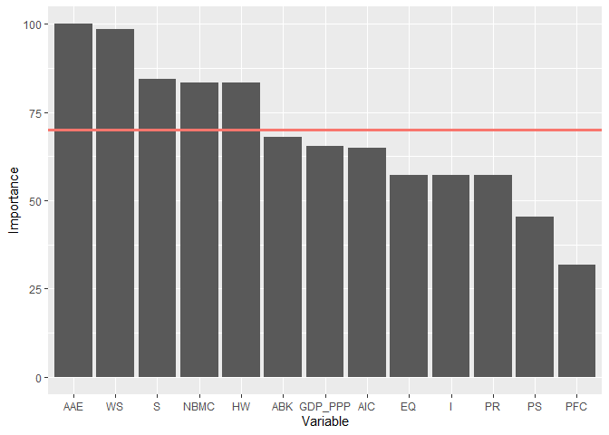
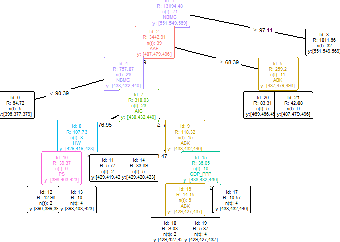

<!-- README.md is generated from README.Rmd. Please edit that file -->

# eat

`EAT` is an alghoritm by which a production frontier is obtained through
and adaptation of regression trees based on CART. The generation of
production frontiers falls within the field of efficiency analysis, of
which some concepts must be known:

  - A **production frontier** is a boundary defined for those feasible
    combinations of input and output that are efficient.
  - A **DMU** (**D**ecision **M**aking **U**nits) is an observation of
    the dataset whose efficiency is to be assessed.
  - A specific DMU is **efficient** when is located at the production
    frontier and it has room for improvement regarding its inputs or
    outputs when it is in the area below the frontier.

The `EAT` algorithm must be conceived as a modeling of the response
variable (output) in order to know its most efficient levels for each of
the different regions of the input space that are generated. Thus,
subspaces with homogeneous DMUs (since they must share the
characteristics of said subspace) are delimited and the maximun expected
output for that subspace is provided. In this way, the `EAT` predictor
results in a monotonic increasing frontier with a stepped form where
each of these steps corresponds to a node of the tree which contains
observations with efficient and non-efficient output levels.

## Installation

You can install the released version of eat from
[CRAN](https://CRAN.R-project.org) with:

``` r
install.packages("eat")
```

And the development version from
[GitHub](https://github.com/MiriamEsteve/EAT) with:

``` r
# install.packages("devtools")
devtools::install_github("MiriamEsteve/EAT")
```

## Example

``` r
library(eat)
data("PISAindex")
```

  - EAT model with 1 input (`NBMC`) and 1 output (`S_PISA`)

<!-- end list -->

``` r
single_model <- EAT(data = PISAindex, 
                    x = 6,
                    y = 4,
                    numStop = 1,
                    fold = 5,
                    na.rm = TRUE)
#> [conflicted] Will prefer dplyr::filter over any other package
#> Warning in preProcess(data, x, y, na.rm = na.rm): Rows with NA values have been omitted
#> 
#> 
#> |id |  N| Prop| R_PISA|   MSE|
#> |:--|--:|----:|------:|-----:|
#> |3  | 32|   45|    549| 38.68|
#> |4  | 15|   21|    420| 18.56|
#> |5  | 24|   34|    479| 33.86|
```

  - Plot the frontier

<!-- end list -->

``` r
frontier(single_model,
         train.data = TRUE,
         train.color = "black",
         pch = 19,
         size = 1,
         rwn = TRUE)
```


  - EAT model with 18 inputs and 3 outputs

<!-- end list -->

``` r
multioutput <- EAT(data = PISAindex, 
                   x = 6:18,
                   y = 3:5,
                   numStop = 6,
                   fold = 5,
                   na.rm = TRUE)
#> [conflicted] Removing existing preference
#> [conflicted] Will prefer dplyr::filter over any other package
#> Warning in preProcess(data, x, y, na.rm = na.rm): Rows with NA values have been omitted
#> 
#> 
#> |id |  N| Prop| S_PISA| R_PISA| M_PISA|   MSE|
#> |:--|--:|----:|------:|------:|------:|-----:|
#> |3  | 32|   45|    569|    432|    438| 42.56|
#> |6  |  5|    7|    496|    419|    429|  8.05|
#> |10 |  6|    8|    438|    440|    432|  6.27|
#> |11 |  2|    3|    432|    398|    440|  2.40|
#> |12 |  5|    7|    440|    403|    469|  5.80|
#> |14 |  6|    8|    479|    429|    454|  3.76|
#> |15 |  4|    6|    496|    419|    487|  3.25|
#> |16 |  5|    7|    396|    423|    479|  9.13|
#> |17 |  6|    8|    377|    429|    496|  6.55|
```

  - Ranking of importance of variables for EAT

<!-- end list -->

``` r
ranking_EAT(object = multioutput,
            r = 2,
            threshold = 75,
            barplot = TRUE)
#> [[1]]
#>         Importance
#> AAE         100.00
#> WS           98.45
#> S            84.52
#> NBMC         83.34
#> HW           83.27
#> ABK          66.86
#> GDP_PPP      65.31
#> AIC          63.80
#> EQ           56.14
#> PR           56.14
#> I            56.14
#> PS           44.39
#> PFC          31.55
#> 
#> [[2]]
```



  - Plot an EAT model

<!-- end list -->

``` r
EAT_plot(object = multioutput)
```



  - Efficiency scores EAT

<!-- end list -->

``` r
scores_EAT <- efficiency_EAT(data = PISAindex,
                             x = 6:18,
                             y = 3:5,
                             object = multioutput,
                             scores_model = "EAT_BCC_out",
                             r = 2,
                             na.rm = TRUE)
#> Warning in preProcess(data, x, y, na.rm = T): Rows with NA values have been omitted
#>     EAT_BCC_out
#> SGP        1.00
#> JPN        1.04
#> KOR        1.06
#> EST        1.04
#> NLD        1.10
#> POL        1.07
#> CHE        1.10
#> CAN        1.06
#> DNK        1.10
#> SVN        1.09
#> BEL        1.10
#> FIN        1.06
#> SWE        1.08
#> GBR        1.09
#> NOR        1.10
#> DEU        1.10
#> IRL        1.06
#> AUT        1.12
#> CZE        1.11
#> LVA        1.00
#> FRA        1.11
#> ISL        1.15
#> NZL        1.08
#> PRT        1.12
#> AUS        1.09
#> RUS        1.01
#> ITA        1.15
#> SVK        1.02
#> LUX        1.16
#> HUN        1.01
#> LTU        1.01
#> USA        1.09
#> BLR        1.16
#> MLT        1.19
#> HRV        1.15
#> ISR        1.17
#> TUR        1.00
#> UKR        1.00
#> CYP        1.10
#> GRC        1.20
#> SRB        1.01
#> MYS        1.00
#> ALB        1.00
#> BGR        1.00
#> ARE        1.00
#> MNE        1.01
#> ROU        1.01
#> KAZ        1.00
#> MDA        1.00
#> AZE        1.00
#> THA        1.01
#> URY        1.00
#> CHL        1.03
#> QAT        1.05
#> MEX        1.00
#> BIH        1.00
#> CRI        1.00
#> JOR        1.00
#> PER        1.05
#> GEO        1.04
#> MKD        1.04
#> LBN        1.04
#> COL        1.02
#> BRA        1.02
#> ARG        1.16
#> IDN        1.00
#> SAU        1.01
#> MAR        1.03
#> PAN        1.00
#> PHL        1.07
#> DOM        1.10
#> 
#> 
#> | Mean| Std. Dev.| Min| Q1| Median|   Q3| Max|
#> |----:|---------:|---:|--:|------:|----:|---:|
#> | 1.06|      0.06|   1|  1|   1.04| 1.04| 1.2|
```

  - Efficiency scores FDH

<!-- end list -->

``` r
scores_FDH <- efficiency_FDH(data = PISAindex,
                             x = 6:18,
                             y = 3:5,
                             scores_model = "FDH_BCC_out",
                             r = 4,
                             na.rm = TRUE)
#> Warning in preProcess(data, x, y, na.rm = T): Rows with NA values have been omitted
#>     FDH_BCC_out
#> SGP      1.0000
#> JPN      1.0000
#> KOR      1.0000
#> EST      1.0000
#> NLD      1.0000
#> POL      1.0000
#> CHE      1.0019
#> CAN      1.0000
#> DNK      1.0138
#> SVN      1.0000
#> BEL      1.0000
#> FIN      1.0000
#> SWE      1.0119
#> GBR      1.0000
#> NOR      1.0261
#> DEU      1.0159
#> IRL      1.0000
#> AUT      1.0341
#> CZE      1.0000
#> LVA      1.0000
#> FRA      1.0000
#> ISL      1.0424
#> NZL      1.0059
#> PRT      1.0000
#> AUS      1.0159
#> RUS      1.0000
#> ITA      1.0000
#> SVK      1.0000
#> LUX      1.0000
#> HUN      1.0000
#> LTU      1.0000
#> USA      1.0000
#> BLR      1.0000
#> MLT      1.0000
#> HRV      1.0000
#> ISR      1.0000
#> TUR      1.0000
#> UKR      1.0000
#> CYP      1.0000
#> GRC      1.0067
#> SRB      1.0000
#> MYS      1.0000
#> ALB      1.0000
#> BGR      1.0000
#> ARE      1.0000
#> MNE      1.0000
#> ROU      1.0000
#> KAZ      1.0000
#> MDA      1.0000
#> AZE      1.0000
#> THA      1.0000
#> URY      1.0000
#> CHL      1.0000
#> QAT      1.0000
#> MEX      1.0000
#> BIH      1.0000
#> CRI      1.0000
#> JOR      1.0000
#> PER      1.0000
#> GEO      1.0000
#> MKD      1.0000
#> LBN      1.0000
#> COL      1.0000
#> BRA      1.0000
#> ARG      1.0000
#> IDN      1.0000
#> SAU      1.0000
#> MAR      1.0000
#> PAN      1.0000
#> PHL      1.0000
#> DOM      1.0000
#> 
#> 
#> | Mean| Std. Dev.| Min| Q1| Median| Q3|  Max|
#> |----:|---------:|---:|--:|------:|--:|----:|
#> |    1|      0.01|   1|  1|      1|  1| 1.04|
```

  - Efficiency jitter plot

<!-- end list -->

``` r
efficiency_jitter(object = multioutput,
                  scores_EAT = scores_EAT$EAT_BCC_out,
                  scores_model = "EAT_BCC_out",
                  upb = NULL,
                  lwb = NULL)
```


  - Efficiency density plot

<!-- end list -->

``` r
efficiency_density(scores_EAT = scores_EAT$EAT_BCC_out,
                   scores_FDH = scores_FDH$FDH_BCC_out)
```


  - EAT predict

<!-- end list -->

``` r
predict_EAT(object = multioutput,
            newdata = PISAindex[, 6:18])
#>    S_PISA_pred R_PISA_pred M_PISA_pred
#> 1          551         549         569
#> 2          551         549         569
#> 3          551         549         569
#> 4          551         549         569
#> 5          551         549         569
#> 6          551         549         569
#> 7          551         549         569
#> 8          551         549         569
#> 9          551         549         569
#> 10         551         549         569
#> 11         551         549         569
#> 12         551         549         569
#> 13         551         549         569
#> 14         551         549         569
#> 15         551         549         569
#> 16         551         549         569
#> 17         551         549         569
#> 18         551         549         569
#> 19         551         549         569
#> 20         487         479         496
#> 21         551         549         569
#> 22         551         549         569
#> 23         551         549         569
#> 24         551         549         569
#> 25         551         549         569
#> 26         487         479         496
#> 27         551         549         569
#> 28         487         479         496
#> 29         551         549         569
#> 30         487         479         496
#> 31         487         479         496
#> 32         551         549         569
#> 33         551         549         569
#> 34         551         549         569
#> 35         551         549         569
#> 36         551         549         569
#> 37         551         549         569
#> 38         469         466         454
#> 39         469         466         454
#> 40         487         479         496
#> 41         551         549         569
#> 42         469         466         454
#> 43         438         432         440
#> 44         429         427         437
#> 45         429         427         437
#> 46         438         432         440
#> 47         429         427         437
#> 48         438         432         440
#> 49         398         403         423
#> 50         429         427         437
#> 51         398         403         423
#> 52         429         419         423
#> 53         429         427         437
#> 54         469         466         454
#> 55         438         432         440
#> 56         429         420         423
#> 57         398         403         423
#> 58         429         427         437
#> 59         429         419         423
#> 60         429         420         423
#> 61         398         403         423
#> 62         429         420         423
#> 63         398         403         423
#> 64         429         420         423
#> 65         429         420         423
#> 66         469         466         454
#> 67         396         377         379
#> 68         398         403         423
#> 69         396         377         379
#> 70         396         377         379
#> 71         396         377         379
#> 72         396         377         379
```

  - RFEAT model

<!-- end list -->

``` r
RFEAT_model <- RFEAT(data = PISAindex,
                     x = 6:18,
                     y = 3:5,
                     numStop = 5,
                     m = 5,
                     s_mtry = "Breiman",
                     na.rm = TRUE)
#> [conflicted] Removing existing preference
#> [conflicted] Will prefer dplyr::filter over any other package
#> Warning in preProcess(data, x, y, na.rm = na.rm): Rows with NA values have been omitted
```

  - RFEAT ranking

<!-- end list -->

``` r
ranking_RFEAT(object = RFEAT_model,
              r = 4,
              barplot = TRUE)
#> [conflicted] Removing existing preference
#> [conflicted] Will prefer dplyr::filter over any other package
#> [conflicted] Removing existing preference
#> [conflicted] Will prefer dplyr::filter over any other package
#> [conflicted] Removing existing preference
#> [conflicted] Will prefer dplyr::filter over any other package
#> [conflicted] Removing existing preference
#> [conflicted] Will prefer dplyr::filter over any other package
#> [conflicted] Removing existing preference
#> [conflicted] Will prefer dplyr::filter over any other package
#> [conflicted] Removing existing preference
#> [conflicted] Will prefer dplyr::filter over any other package
#> [conflicted] Removing existing preference
#> [conflicted] Will prefer dplyr::filter over any other package
#> [conflicted] Removing existing preference
#> [conflicted] Will prefer dplyr::filter over any other package
#> [conflicted] Removing existing preference
#> [conflicted] Will prefer dplyr::filter over any other package
#> [conflicted] Removing existing preference
#> [conflicted] Will prefer dplyr::filter over any other package
#> [conflicted] Removing existing preference
#> [conflicted] Will prefer dplyr::filter over any other package
#> [conflicted] Removing existing preference
#> [conflicted] Will prefer dplyr::filter over any other package
#> [conflicted] Removing existing preference
#> [conflicted] Will prefer dplyr::filter over any other package
#> [[1]]
#>          Importance
#> S         7.8516262
#> I         7.6034547
#> WS        7.5896799
#> ABK       3.9638420
#> GDP_PPP   1.8053244
#> PS        0.7758896
#> AIC       0.5801435
#> HW       -1.5107148
#> PR       -3.4127512
#> PFC      -7.4190337
#> AAE      -8.1249967
#> EQ      -13.3661822
#> NBMC    -18.3246284
#> 
#> [[2]]
```


  - RFEAT scores

<!-- end list -->

``` r
efficiency_RFEAT(data = PISAindex,
                 x = 6:18,
                 y = 3:5,
                 object = RFEAT_model)
#> Warning in preProcess(data, x, y, na.rm = T): Rows with NA values have been omitted
#>      scoreRF
#> SGP 0.930053
#> JPN 0.995085
#> KOR 0.979087
#> EST 0.971702
#> NLD 0.992293
#> POL 0.980620
#> CHE 1.002718
#> CAN 0.991892
#> DNK 1.011788
#> SVN 1.007495
#> BEL 0.991732
#> FIN 0.997318
#> SWE 1.011858
#> GBR 1.000792
#> NOR 1.032866
#> DEU 1.014712
#> IRL 0.993050
#> AUT 1.027255
#> CZE 1.018036
#> LVA 1.004839
#> FRA 1.008081
#> ISL 1.069091
#> NZL 1.004724
#> PRT 0.953252
#> AUS 1.014712
#> RUS 0.997541
#> ITA 0.994251
#> SVK 1.004115
#> LUX 1.031447
#> HUN 0.957563
#> LTU 1.016598
#> USA 0.988515
#> BLR 0.988608
#> MLT 0.961864
#> HRV 0.978288
#> ISR 1.002553
#> TUR 0.969658
#> UKR 0.954797
#> CYP 1.056319
#> GRC 1.018625
#> SRB 1.013393
#> MYS 0.974545
#> ALB 0.994966
#> BGR 0.997706
#> ARE 0.987500
#> MNE 1.028979
#> ROU 0.988318
#> KAZ 1.067139
#> MDA 1.003738
#> AZE 0.987143
#> THA 0.987324
#> URY 1.017330
#> CHL 1.011504
#> QAT 1.028162
#> MEX 1.001429
#> BIH 1.013896
#> CRI 1.019718
#> JOR 0.991608
#> PER 0.938155
#> GEO 1.124623
#> MKD 1.025666
#> LBN 1.027083
#> COL 1.004854
#> BRA 1.021792
#> ARG 1.095050
#> IDN 0.980303
#> SAU 1.030075
#> MAR 1.015761
#> PAN 0.959682
#> PHL 1.014731
#> DOM 1.037427
```

  - RFEAT predict

<!-- end list -->

``` r
predict_RFEAT(object = RFEAT_model,
              newdata = PISAindex[, 6:18])
#>    S_PISA_pred R_PISA_pred M_PISA_pred
#> 1        521.4       516.6       529.2
#> 2        526.4       523.2       531.6
#> 3        510.4       506.8       515.0
#> 4        515.2       508.2       516.0
#> 5        510.4       510.8       515.0
#> 6        502.6       503.6       506.0
#> 7        512.4       514.8       516.4
#> 8        513.8       516.4       516.4
#> 9        510.4       510.8       515.0
#> 10       510.8       508.8       513.0
#> 11       503.2       502.8       503.8
#> 12       520.6       519.0       518.8
#> 13       510.4       512.0       515.0
#> 14       505.4       506.2       505.0
#> 15       514.8       515.4       518.8
#> 16       510.4       510.8       515.0
#> 17       510.4       514.4       515.0
#> 18       509.2       510.6       512.6
#> 19       506.6       506.4       508.0
#> 20       492.4       487.0       498.4
#> 21       501.4       502.6       499.0
#> 22       524.0       522.6       529.2
#> 23       510.4       512.0       515.0
#> 24       471.2       470.0       469.0
#> 25       510.4       512.0       515.0
#> 26       485.6       483.4       486.8
#> 27       471.4       474.8       484.2
#> 28       474.2       469.4       488.0
#> 29       492.0       485.8       500.0
#> 30       462.2       455.8       472.0
#> 31       490.0       487.6       491.6
#> 32       471.4       471.6       467.2
#> 33       498.0       499.2       495.0
#> 34       471.0       468.6       480.6
#> 35       446.6       439.8       454.0
#> 36       471.0       468.6       481.2
#> 37       468.6       471.2       474.2
#> 38       453.8       453.4       443.6
#> 39       447.8       447.8       443.2
#> 40       465.8       463.2       476.4
#> 41       468.4       467.6       459.4
#> 42       450.0       446.2       454.0
#> 43       429.2       420.2       428.8
#> 44       427.2       422.8       434.8
#> 45       433.2       431.6       435.0
#> 46       428.6       426.6       430.4
#> 47       439.4       433.2       446.6
#> 48       426.6       423.0       426.8
#> 49       444.4       436.2       451.4
#> 50       429.6       427.4       426.8
#> 51       411.0       404.8       414.6
#> 52       420.6       405.0       414.4
#> 53       433.6       434.4       431.6
#> 54       456.6       457.2       450.8
#> 55       430.8       428.4       429.8
#> 56       427.6       420.6       421.0
#> 57       418.0       408.6       422.8
#> 58       433.6       434.4       431.6
#> 59       425.4       422.0       418.0
#> 60       388.0       376.2       381.0
#> 61       438.2       430.4       447.6
#> 62       423.6       413.2       422.8
#> 63       394.4       387.0       403.8
#> 64       417.8       414.0       410.6
#> 65       421.4       422.0       416.2
#> 66       442.4       441.8       441.0
#> 67       388.2       367.6       373.8
#> 68       412.2       411.0       415.0
#> 69       388.2       367.6       373.8
#> 70       374.2       361.8       363.4
#> 71       366.4       354.8       358.2
#> 72       362.2       354.8       352.6
```

Please, check the vignette for more details.
