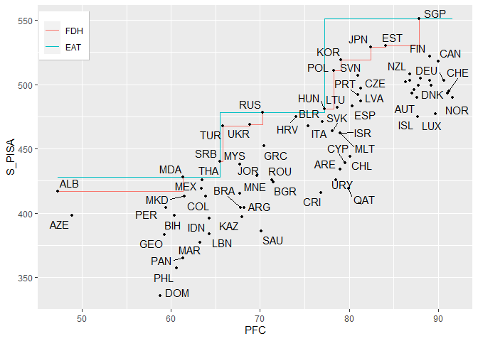
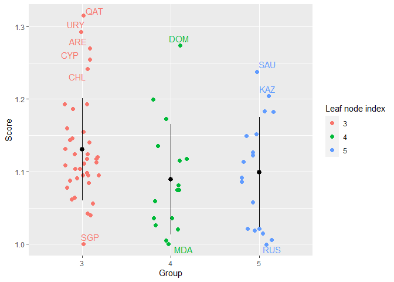
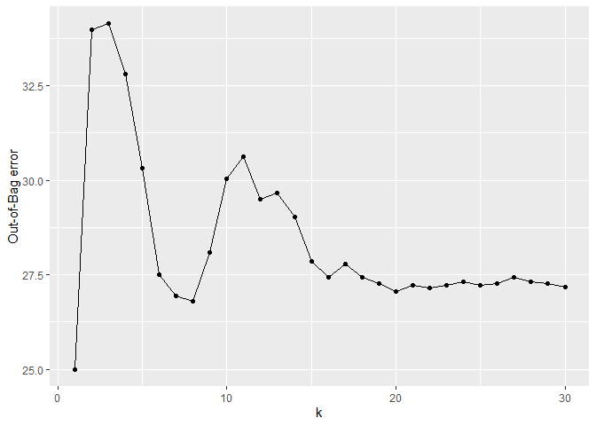

<!-- README.md is generated from README.Rmd. Please edit that file -->

# eat

The `EAT` algorithm performs a regression tree based on CART methodology
under a new approach that guarantees obtaining a frontier as estimator
that fulfills the property of free disposability. This new technique has
been baptized as Efficiency Analysis Trees. Some of its main functions
are:

  - To create homogeneous groups of DMUs in terms of their inputs and to
    know for each of these groups, what is the maximum expected output.

  - To know which DMUs exercise best practices and which of them do not
    obtain a performance according to their resources level.

  - To know what variables are more relevant in obtaining efficient
    levels of output.

## Installation

You can install the released version of eat from
[CRAN](https://CRAN.R-project.org) with:

``` r
install.packages("eat")
```

And the development version from
[GitHub](https://github.com/MiriamEsteve/EAT) with:

``` r
devtools::install_github("MiriamEsteve/EAT")
```

## Example

``` r
library(eat)
data("PISAindex")
```

  - EAT model with 1 input (`NBMC`) and 1 output (`S_PISA`)

<!-- end list -->

``` r
single_model <- EAT(data = PISAindex, 
                    x = 15, # input 
                    y = 3) # output
#> [conflicted] Will prefer dplyr::filter over any other package
```

  - Print an `EAT` object

<!-- end list -->

``` r
print(single_model)
```

    #>  [1] y: [ 551 ] || R: 11507.5 n(t): 72 
    #>  
    #>  |  [2] PFC < 77.2 --> y: [ 478 ] || R: 2324.47 n(t): 34 
    #>  
    #>  |   |  [4] PFC < 65.45 --> y: [ 428 ] <*> || R: 390.17 n(t): 16 
    #>  
    #>  |   |  [5] PFC >= 65.45 --> y: [ 478 ] <*> || R: 637.08 n(t): 18 
    #>  
    #>  |  [3] PFC >= 77.2 --> y: [ 551 ] <*> || R: 2452.83 n(t): 38 
    #>  
    #> <*> is a leaf node

  - Summary of an `EAT` object

<!-- end list -->

``` r
summary(single_model)
```

    #> 
    #>   Formula:  S_PISA ~ PFC 
    #> 
    #>  # ========================== # 
    #>  #   Summary for leaf nodes   # 
    #>  # ========================== # 
    #>  
    #>  id n(t)  % S_PISA    R(t)
    #>   3   38 53    551 2452.83
    #>   4   16 22    428  390.17
    #>   5   18 25    478  637.08
    #> 
    #>  # ========================== # 
    #>  #            Tree            # 
    #>  # ========================== # 
    #>  
    #>  Interior nodes: 2 
    #>      Leaf nodes: 3 
    #>     Total nodes: 5 
    #>  
    #>            R(T): 3480.08 
    #>         numStop: 5 
    #>            fold: 5 
    #>       max.depth: 
    #>      max.leaves:
    #>  
    #>  # ========================== # 
    #>  # Primary & surrogate splits # 
    #>  # ========================== # 
    #>  
    #>  Node 1 --> {2,3} || PFC --> {R: 4777.31, s: 77.2}
    #> 
    #>  Node 2 --> {4,5} || PFC --> {R: 1027.25, s: 65.45}

  - Number of leaf nodes of an `EAT` object

<!-- end list -->

``` r
size(single_model)
```

    #> The number of leaf nodes of the EAT model is: 3

  - Frontier levels of output for an `EAT` object

<!-- end list -->

``` r
frontier.levels(single_model)
```

    #> The frontier levels of the outputs at the leaf nodes are:

    #>   S_PISA
    #> 1    551
    #> 2    428
    #> 3    478

  - Descriptive analysis for an `EAT` object

<!-- end list -->

``` r
descriptiveEAT <- descrEAT(single_model)

descriptiveEAT
```

    #>   Node n(t)   %   mean     var    sd min     Q1 median     Q3 max   RMSE
    #> 1    1   72 100 455.06 2334.59 48.32 336 416.75  466.0 495.25 551 107.27
    #> 2    2   34  47 416.88 1223.02 34.97 336 397.25  415.5 435.75 478  70.16
    #> 3    3   38  53 489.21  851.95 29.19 419 478.00  494.0 504.50 551  68.17
    #> 4    4   16  22 394.62  684.65 26.17 336 381.50  398.0 414.00 428  41.90
    #> 5    5   18  25 436.67  889.29 29.82 386 415.25  433.5 468.00 478  50.48

  - Plot the frontier

<!-- end list -->

``` r
frontier(object = single_model,
         FDH = TRUE, 
         observed.data = TRUE,
         rwn = TRUE)
```

    #> Warning: ggrepel: 8 unlabeled data points (too many overlaps). Consider
    #> increasing max.overlaps



  - EAT model with 13 inputs and 3 outputs

<!-- end list -->

``` r
multioutput <- EAT(data = PISAindex, 
                   x = 6:18,
                   y = 3:5)
```

    #> [conflicted] Removing existing preference

    #> [conflicted] Will prefer dplyr::filter over any other package

    #> Warning in preProcess(data = data, x = x, y = y, numStop = numStop, fold = fold, : Rows with NA values have been omitted .

  - Ranking of importance of variables for EAT

<!-- end list -->

``` r
rankingEAT(object = multioutput,
           barplot = TRUE,
           threshold = 70,
           digits = 2)
```

    #> $scores
    #>         Importance
    #> AAE         100.00
    #> WS           98.45
    #> S            84.51
    #> NBMC         83.37
    #> HW           83.31
    #> ABK          67.97
    #> GDP_PPP      65.37
    #> AIC          64.89
    #> EQ           57.11
    #> PR           57.05
    #> I            57.05
    #> PS           45.41
    #> PFC          31.67
    #> 
    #> $barplot


  - Plot an EAT model

<!-- end list -->

``` r
plotEAT(object = multioutput)
```


  - Tuning an EAT model

<!-- end list -->

``` r
n <- nrow(PISAindex) # Observations in the dataset
t_index <- sample(1:n, n * 0.7) # Training indexes
training <- PISAindex[t_index, ] # Training set
test <- PISAindex[-t_index, ] # Test set

bestEAT(training = training, 
        test = test,
        x = 6:18,
        y = 3:5,
        numStop = c(5, 7, 10),
        fold = c(5, 7))
```

    #> Warning in preProcess(test, x, y, na.rm = na.rm): Rows with NA values have been omitted .

    #> [conflicted] Removing existing preference

    #> [conflicted] Will prefer dplyr::filter over any other package

    #> [conflicted] Removing existing preference

    #> [conflicted] Will prefer dplyr::filter over any other package

    #> [conflicted] Removing existing preference

    #> [conflicted] Will prefer dplyr::filter over any other package

    #> [conflicted] Removing existing preference

    #> [conflicted] Will prefer dplyr::filter over any other package

    #> [conflicted] Removing existing preference

    #> [conflicted] Will prefer dplyr::filter over any other package

    #> [conflicted] Removing existing preference

    #> [conflicted] Will prefer dplyr::filter over any other package

    #>   numStop fold  RMSE leaves
    #> 1       7    5 66.94     10
    #> 2       7    7 66.94     10
    #> 3       5    7 71.87      8
    #> 4       5    5 84.60      7
    #> 5      10    5 85.06      5
    #> 6      10    7 85.06      5

  - Efficiency scores EAT

<!-- end list -->

``` r
single_model <- EAT(data = PISAindex, 
                    x = 15, # input 
                    y = 3) # output
```

    #> [conflicted] Removing existing preference

    #> [conflicted] Will prefer dplyr::filter over any other package

``` r
scores_EAT <-  efficiencyEAT(data = PISAindex,
                            x = 15, 
                            y = 3,
                            object = single_model, 
                            scores_model = "BCC.OUT",
                            digits = 3,
                            FDH = TRUE)
```

    #>     EAT_BCC_OUT FDH_BCC_OUT
    #> SGP       1.000       1.000
    #> JPN       1.042       1.000
    #> KOR       1.062       1.000
    #> EST       1.040       1.000
    #> NLD       1.095       1.095
    #> POL       1.078       1.000
    #> CHE       1.113       1.113
    #> CAN       1.064       1.064
    #> DNK       1.118       1.118
    #> SVN       1.087       1.024
    #> BEL       1.104       1.062
    #> FIN       1.056       1.056
    #> SWE       1.104       1.104
    #> GBR       1.091       1.091
    #> NOR       1.124       1.124
    #> DEU       1.095       1.095
    #> IRL       1.111       1.069
    #> AUT       1.124       1.082
    #> CZE       1.109       1.044
    #> LVA       1.131       1.066
    #> FRA       1.118       1.075
    #> ISL       1.160       1.116
    #> NZL       1.085       1.043
    #> PRT       1.120       1.055
    #> AUS       1.095       1.054
    #> RUS       1.000       1.000
    #> ITA       1.021       1.021
    #> SVK       1.187       1.037
    #> LUX       1.155       1.155
    #> HUN       1.146       1.000
    #> LTU       1.143       1.060
    #> ESP       1.141       1.075
    #> USA       1.098       1.056
    #> BLR       1.015       1.015
    #> MLT       1.193       1.106
    #> HRV       1.006       1.006
    #> ISR       1.193       1.106
    #> TUR       1.021       1.000
    #> UKR       1.019       1.000
    #> CYP       1.255       1.182
    #> GRC       1.058       1.058
    #> SRB       1.086       1.000
    #> MYS       1.091       1.068
    #> ALB       1.026       1.000
    #> BGR       1.127       1.127
    #> ARE       1.270       1.177
    #> MNE       1.152       1.128
    #> ROU       1.122       1.122
    #> KAZ       1.204       1.179
    #> MDA       1.000       1.000
    #> AZE       1.075       1.048
    #> THA       1.005       1.005
    #> URY       1.293       1.200
    #> CHL       1.241       1.169
    #> QAT       1.315       1.239
    #> MEX       1.021       1.021
    #> BIH       1.075       1.048
    #> CRI       1.149       1.149
    #> JOR       1.114       1.093
    #> PER       1.059       1.032
    #> GEO       1.117       1.089
    #> MKD       1.036       1.036
    #> LBN       1.115       1.115
    #> COL       1.036       1.036
    #> BRA       1.183       1.158
    #> ARG       1.183       1.158
    #> IDN       1.081       1.081
    #> SAU       1.238       1.215
    #> MAR       1.135       1.135
    #> PAN       1.173       1.173
    #> PHL       1.199       1.168
    #> DOM       1.274       1.241
    #> 
    #>  Model  Mean Std. Dev. Min    Q1 Median    Q3   Max
    #>    EAT 1.114     0.074   1 1.061  1.110 1.110 1.315
    #>    FDH 1.081     0.065   1 1.030  1.069 1.069 1.241

  - Efficiency scores CEAT

<!-- end list -->

``` r
scores_CEAT <- efficiencyCEAT(data = PISAindex,
                              x = 15, 
                              y = 3,
                              object = single_model, 
                              scores_model = "BCC.INP",
                              digits = 3,
                              DEA = TRUE)
```

    #>     CEAT_BCC_INP DEA_BCC_INP
    #> SGP        0.878       1.000
    #> JPN        0.872       0.986
    #> KOR        0.878       0.989
    #> EST        0.857       0.969
    #> NLD        0.736       0.824
    #> POL        0.862       0.968
    #> CHE        0.697       0.777
    #> CAN        0.768       0.865
    #> DNK        0.693       0.772
    #> SVN        0.821       0.920
    #> BEL        0.735       0.821
    #> FIN        0.787       0.888
    #> SWE        0.724       0.809
    #> GBR        0.750       0.840
    #> NOR        0.680       0.757
    #> DEU        0.723       0.809
    #> IRL        0.731       0.816
    #> AUT        0.712       0.792
    #> CZE        0.788       0.880
    #> LVA        0.758       0.843
    #> FRA        0.725       0.808
    #> ISL        0.669       0.739
    #> NZL        0.769       0.862
    #> PRT        0.776       0.865
    #> AUS        0.754       0.845
    #> RUS        0.846       0.936
    #> ITA        0.756       0.832
    #> SVK        0.717       0.787
    #> LUX        0.660       0.729
    #> HUN        0.779       0.864
    #> LTU        0.768       0.851
    #> ESP        0.755       0.838
    #> USA        0.756       0.846
    #> BLR        0.750       0.826
    #> MLT        0.703       0.771
    #> HRV        0.792       0.875
    #> ISR        0.703       0.771
    #> TUR        0.866       0.953
    #> UKR        0.831       0.916
    #> CYP        0.628       0.678
    #> GRC        0.754       0.822
    #> SRB        0.767       0.829
    #> MYS        0.734       0.792
    #> ALB        1.000       1.000
    #> BGR        0.661       0.691
    #> ARE        0.616       0.663
    #> MNE        0.698       0.698
    #> ROU        0.662       0.701
    #> KAZ        0.696       0.696
    #> MDA        0.771       0.825
    #> AZE        0.967       0.967
    #> THA        0.744       0.787
    #> URY        0.602       0.637
    #> CHL        0.638       0.692
    #> QAT        0.591       0.599
    #> MEX        0.746       0.755
    #> BIH        0.782       0.782
    #> CRI        0.615       0.615
    #> JOR        0.682       0.731
    #> PER        0.795       0.795
    #> GEO        0.798       0.798
    #> MKD        0.768       0.768
    #> LBN        0.735       0.735
    #> COL        0.739       0.739
    #> BRA        0.697       0.697
    #> ARG        0.693       0.693
    #> IDN        0.735       0.735
    #> SAU        0.674       0.674
    #> MAR        0.748       0.748
    #> PAN        0.770       0.770
    #> PHL        0.780       0.780
    #> DOM        0.804       0.804
    #> 
    #>  Model  Mean Std. Dev.   Min    Q1 Median    Q3 Max
    #>   CEAT 0.749     0.077 0.591 0.698  0.749 0.749   1
    #>    DEA 0.805     0.094 0.599 0.739  0.801 0.801   1

  - Efficiency jitter plot

<!-- end list -->

``` r
efficiencyJitter(object = single_model,
                 df_scores = scores_EAT$EAT_BCC_OUT,
                 scores_model = "BCC.OUT",
                 lwb = 1.2)
```



  - Efficiency density plot

<!-- end list -->

``` r
efficiencyDensity(df_scores = scores_EAT[, 3:4],
                  model = c("EAT", "FDH"))
```


  - RFEAT model

<!-- end list -->

``` r
forest <- RFEAT(data = PISAindex, 
                x = 6:18, # input 
                y = 5, # output
                numStop = 5, 
                m = 30,
                s_mtry = "BRM",
                na.rm = TRUE)
```

    #> [conflicted] Removing existing preference

    #> [conflicted] Will prefer dplyr::filter over any other package

  - Print a `RFEAT` object

<!-- end list -->

``` r
print(forest)
```

    #> 
    #>   Formula:  M_PISA ~ NBMC + WS + S + PS + ABK + AIC + HW + EQ + PR + PFC + I + AAE + GDP_PPP 
    #> 
    #>  # ========================== # 
    #>  #           Forest           # 
    #>  # ========================== # 
    #>  
    #>  Error: 738.42
    #>  numStop: 5
    #>  No. of trees (m): 30
    #>  No. of inputs tried (s_mtry): BRM

  - Plot the Out-of-Bag error for a forest made up of k trees

<!-- end list -->

``` r
plotRFEAT(forest)
```



  - RFEAT ranking

<!-- end list -->

``` r
rankingRFEAT(object = forest, barplot = TRUE,
             digits = 2)
```

    #> [conflicted] Removing existing preference

    #> [conflicted] Will prefer dplyr::filter over any other package

    #> [conflicted] Removing existing preference

    #> [conflicted] Will prefer dplyr::filter over any other package

    #> [conflicted] Removing existing preference

    #> [conflicted] Will prefer dplyr::filter over any other package

    #> [conflicted] Removing existing preference

    #> [conflicted] Will prefer dplyr::filter over any other package

    #> [conflicted] Removing existing preference

    #> [conflicted] Will prefer dplyr::filter over any other package

    #> [conflicted] Removing existing preference

    #> [conflicted] Will prefer dplyr::filter over any other package

    #> [conflicted] Removing existing preference

    #> [conflicted] Will prefer dplyr::filter over any other package

    #> [conflicted] Removing existing preference

    #> [conflicted] Will prefer dplyr::filter over any other package

    #> [conflicted] Removing existing preference

    #> [conflicted] Will prefer dplyr::filter over any other package

    #> [conflicted] Removing existing preference

    #> [conflicted] Will prefer dplyr::filter over any other package

    #> [conflicted] Removing existing preference

    #> [conflicted] Will prefer dplyr::filter over any other package

    #> [conflicted] Removing existing preference

    #> [conflicted] Will prefer dplyr::filter over any other package

    #> [conflicted] Removing existing preference

    #> [conflicted] Will prefer dplyr::filter over any other package

    #> $scores
    #>         Importance
    #> PS           14.25
    #> PR           14.08
    #> AAE          13.97
    #> EQ           11.86
    #> S            10.80
    #> HW            9.36
    #> AIC           6.36
    #> I             4.49
    #> NBMC          3.26
    #> WS           -1.79
    #> GDP_PPP      -4.68
    #> PFC          -4.77
    #> ABK          -6.11
    #> 
    #> $barplot


  - Tuning a RFEAT model

<!-- end list -->

``` r
bestRFEAT(training = training, 
          test = test,
          x = 6:18,
          y = 3:5,
          numStop = c(5, 10),
          m = c(30, 40),
          s_mtry = c("BRM", "3"))
```

    #> Warning in preProcess(test, x, y, na.rm = na.rm): Rows with NA values have been omitted .

    #> [conflicted] Removing existing preference

    #> [conflicted] Will prefer dplyr::filter over any other package

    #> [conflicted] Removing existing preference

    #> [conflicted] Will prefer dplyr::filter over any other package

    #> [conflicted] Removing existing preference

    #> [conflicted] Will prefer dplyr::filter over any other package

    #> [conflicted] Removing existing preference

    #> [conflicted] Will prefer dplyr::filter over any other package

    #> [conflicted] Removing existing preference

    #> [conflicted] Will prefer dplyr::filter over any other package

    #> [conflicted] Removing existing preference

    #> [conflicted] Will prefer dplyr::filter over any other package

    #> [conflicted] Removing existing preference

    #> [conflicted] Will prefer dplyr::filter over any other package

    #> [conflicted] Removing existing preference

    #> [conflicted] Will prefer dplyr::filter over any other package

    #>   numStop  m s_mtry  RMSE
    #> 1       5 40      3 57.44
    #> 2       5 40    BRM 57.72
    #> 3       5 30    BRM 58.39
    #> 4       5 30      3 59.13
    #> 5      10 30    BRM 62.43
    #> 6      10 40    BRM 63.18
    #> 7      10 40      3 65.02
    #> 8      10 30      3 68.43

  - RFEAT scores

<!-- end list -->

``` r
efficiencyRFEAT(data = PISAindex,
                x = 6:18, # input
                y = 5, # output
                object = forest,
                FDH = TRUE)
```

    #>     RFEAT_BCC_OUT FDH_BCC_OUT
    #> SGP         0.936       1.000
    #> JPN         1.024       1.000
    #> KOR         1.004       1.000
    #> EST         0.982       1.000
    #> NLD         0.999       1.000
    #> POL         0.982       1.000
    #> CHE         1.026       1.002
    #> CAN         1.010       1.008
    #> DNK         1.017       1.014
    #> SVN         1.004       1.000
    #> BEL         1.006       1.000
    #> FIN         1.021       1.018
    #> SWE         1.029       1.028
    #> GBR         1.019       1.000
    #> NOR         1.039       1.030
    #> DEU         1.028       1.032
    #> IRL         1.031       1.032
    #> AUT         1.024       1.034
    #> CZE         1.014       1.000
    #> LVA         0.997       1.000
    #> FRA         1.037       1.000
    #> ISL         1.070       1.042
    #> NZL         1.048       1.045
    #> PRT         0.995       1.000
    #> AUS         1.054       1.051
    #> RUS         0.963       1.000
    #> ITA         1.011       1.000
    #> SVK         0.997       1.000
    #> LUX         1.053       1.000
    #> HUN         1.008       1.000
    #> LTU         1.020       1.000
    #> ESP         1.030       1.000
    #> USA         1.033       1.000
    #> BLR         0.992       1.000
    #> MLT         1.026       1.000
    #> HRV         1.034       1.000
    #> ISR         1.050       1.000
    #> TUR         0.979       1.000
    #> UKR         0.981       1.000
    #> CYP         1.095       1.000
    #> GRC         1.063       1.007
    #> SRB         1.002       1.000
    #> MYS         0.998       1.000
    #> ALB         0.982       1.000
    #> BGR         1.031       1.000
    #> ARE         1.014       1.000
    #> MNE         1.022       1.000
    #> ROU         1.031       1.000
    #> KAZ         1.018       1.000
    #> MDA         1.003       1.000
    #> AZE         0.972       1.000
    #> THA         0.991       1.000
    #> URY         1.045       1.000
    #> CHL         1.097       1.005
    #> QAT         1.070       1.000
    #> MEX         1.005       1.000
    #> BIH         1.042       1.000
    #> CRI         1.085       1.000
    #> JOR         1.046       1.000
    #> PER         0.997       1.000
    #> GEO         1.060       1.000
    #> MKD         1.052       1.000
    #> LBN         1.037       1.000
    #> COL         1.055       1.000
    #> BRA         1.074       1.000
    #> ARG         1.157       1.000
    #> IDN         1.034       1.000
    #> SAU         1.100       1.000
    #> MAR         1.031       1.000
    #> PAN         1.116       1.000
    #> PHL         1.049       1.000
    #> DOM         1.145       1.000
    #> 
    #>  Model  Mean Std. Dev.   Min    Q1 Median    Q3   Max
    #>  RFEAT 1.029     0.039 0.936 1.003  1.026 1.026 1.157
    #>    FDH 1.005     0.012 1.000 1.000  1.000 1.000 1.051

  - EAT and RFEAT predictions

<!-- end list -->

``` r
input <- c(6, 7, 8, 12, 17)
output <- 3:5

EAT_model <- EAT(data = PISAindex, x = input, y = output)
```

    #> [conflicted] Removing existing preference

    #> [conflicted] Will prefer dplyr::filter over any other package

    #> Warning in preProcess(data = data, x = x, y = y, numStop = numStop, fold = fold, : Rows with NA values have been omitted .

``` r
RFEAT_model <- RFEAT(data = PISAindex, x = input, y = output)
```

    #> [conflicted] Removing existing preference
    #> [conflicted] Will prefer dplyr::filter over any other package

    #> Warning in preProcess(data = data, x = x, y = y, numStop = numStop, na.rm = na.rm): Rows with NA values have been omitted .

``` r
# PREDICTIONS
predictions_EAT <- predict(object = EAT_model, newdata = PISAindex[, input])
predictions_RFEAT <- predict(object = RFEAT_model, newdata = PISAindex[, input])
```

Please, check the vignette for more details.
